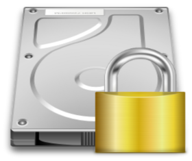
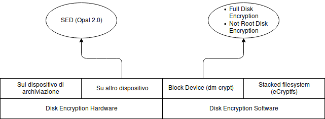
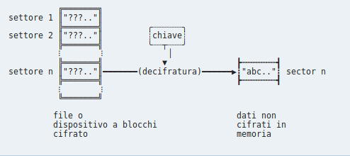
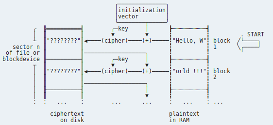

# Disk Encryption

 

 

 

1. #### Introduzione

  - 1.1 Introduzione

  - 1.2 Transparent Encryption

  - 1.3 Disk encryption vs. filesystem-level encryption

  - 1.4 Disk encryption and Trusted Platform Module

2. #### Full Disk Encryption

  - 2.1 Benefici

  - 2.2 Il problema della chiave al Boot

3. #### Vari strumenti di Disk Encryption

  - 3.1 Disk Encryption hardware

  - 3.2 Disk Encryption Software

4. #### Problemi di sicurezza

5. #### Metodi

6. #### Comparazione dei software di Disk Encryption

  - 6.1 Cifratura stacked filesystem

    - eCryptfs

    - EncFs

  - 6.2 Cifratura Block device

    - loop-AES

    - dm-crypt + LUKS

    - TrueCrypt

7. #### Cosa scegliere?

8. #### Come funziona la Disk Encryption

9. #### Demo

10. #### Appendice A: Disk Encryption nei database

  - 10.1 Transparent Database Encryption (TDE)

  - 10.2 Encrypting File System (EFS)

11. #### Fonti

 

 

## 1. Introduzione

La crittografia del disco è una tecnologia che protegge le informazioni convertendole in codice illeggibile che non può essere facilmente decifrato da persone non autorizzate. La crittografia del disco utilizza un software di crittografia disco o hardware per crittografare ogni bit di dati che va su un disco o sul volume di un disco. La crittografia del disco impedisce l'accesso non autorizzato all'archiviazione dei dati.
L'espressione Full Disk Encryption o Whole Disk Encryption indica un disco crittografato completamente ad eccezione della partizione di avvio del sistema operativo. ALcuni potenti strumenti di crittografia a livello hardware possono crittografare l'intero disco, compresa la partizione di avvio del sistema operativo.
Rispetto ai controlli di accesso generalmente attuati da un sistema operativo (OS), la crittografia protegge passivamente la riservatezza dei dati anche quando il sistema operativo non è attivo, ad esempio se i dati vengono letti direttamente dall'hardware o da un altro sistema operativo. Inoltre, il cripto-shredding elimina la necessità di cancellare i dati alla fine del ciclo di vita del disco.
I dati del disco vengono protetti mediante crittografia simmetrica con la chiave generata casualmente quando viene creata la crittografia di un disco. Questa chiave è in qualche modo crittografata usando una password o una frase di passaggio noti (idealmente) solo per l'utente. Successivamente, per accedere ai dati del disco, l'utente deve fornire la password per rendere la chiave disponibile al software. Ciò deve essere fatto dopo ogni avvio del sistema operativo prima che i dati crittografati possano essere utilizzati.

#### 1.1 Transparent Encryption<a href="https://en.wikipedia.org/wiki/Disk_encryption#Transparent_encryption">Wikipedia</a>

La Transparent Encryption, nota anche come crittografia in tempo reale o crittografia on-the-fly (OTFE), è un metodo utilizzato da alcuni software di crittografia del disco. "Trasparente" si riferisce al fatto che i dati vengono crittografati o decriptati automaticamente nel momento in cui vengono caricati o salvati.
Con la transparent Encryption i dati diventano accessibili nel momento in cui viene fornita la chiave, e a quel punto il volume viene montato come se fosse un'unità fisica, rendendo i file accessibili come quelli non crittografati.
L'intero sistema di file all'interno del volume viene crittografato (inclusi i nomi di file, i nomi delle cartelle, il contenuto dei file e altri meta-dati).
In generale, ogni metodo in cui i dati vengono trasparentemente crittografati sulla scrittura e decrittografati sulla lettura può essere chiamato transparent encryption.

#### 1.2 Disk encryption vs. filesystem-level encryption<a href="https://en.wikipedia.org/wiki/Disk_encryption#Disk_encryption_vs._filesystem-level_encryption">Wikipedia</a>

La crittografia del disco non sostituisce la crittografia dei file in tutte le situazioni. La crittografia del disco viene talvolta utilizzata in combinazione con la crittografia a livello di filesystem con l'intento di fornire un'implementazione più sicura. Poiché la crittografia del disco utilizza generalmente la stessa chiave per crittografare l'intero volume, tutti i dati possono essere decriptabili quando il sistema viene eseguito. Tuttavia, alcune soluzioni di crittografia disco utilizzano più chiavi per crittografare diverse partizioni. Se un attaccante ha accesso al computer in fase di esecuzione, l'attaccante ha accesso a tutti i file. La codifica convenzionale di file e cartelle comprende invece diverse chiavi per diverse porzioni del disco. Pertanto, un utente malintenzionato non può estrarre informazioni da file e cartelle ancora cifrati.
A differenza della crittografia del disco, la crittografia a livello di file system non codifica tipicamente i metadati del filesystem, ad esempio la struttura della directory, i nomi dei file, i timestamp o le dimensioni dei moduli.

#### 1.3 Disk encryption and Trusted Platform Module<a href="https://en.wikipedia.org/wiki/Disk_encryption#Disk_encryption_and_Trusted_Platform_Module">Wikipedia</a>

Il Trusted Platform Module (TPM) è un criptoprocessore sicuro incorporato nella scheda madre che può essere utilizzato per l'autenticazione di un dispositivo hardware. Poiché ogni chip TPM è unico a un particolare dispositivo, è in grado di eseguire l'autenticazione delle piattaforme. Può essere utilizzato per verificare che il sistema che cerca l'accesso è il sistema previsto.
Un numero limitato di soluzioni di crittografia disco supporta TPM. Queste implementazioni possono avvolgere la chiave di decodifica usando il TPM, quindi collegando l'unità disco rigido (HDD) a un particolare dispositivo. Se l'HDD viene rimosso da quel particolare dispositivo e posto in un altro, il processo di decrittografia non riesce. Il ripristino è possibile con la password di decrittografia o il token.
Anche se questo ha il vantaggio che il disco non può essere rimosso dal dispositivo, potrebbe generare un singolo punto di errore nella crittografia. Ad esempio, se qualcosa accade al TPM o alla scheda madre, un utente non sarebbe in grado di accedere ai dati collegando l'unità disco a un altro computer, a meno che tale utente non disponga di una chiave di ripristino separata.

## 2. Full disk encryption<a href="https://en.wikipedia.org/wiki/Disk_encryption#Full_disk_encryption">Wikipedia</a>

#### 2.1 Benefici<a href="https://en.wikipedia.org/wiki/Disk_encryption#Benefits">Wikipedia</a>

La Full Disk Encryption ha diversi vantaggi rispetto alla File Encryption regolare, o celle crittografate. Di seguito sono elencati alcuni vantaggi della crittografia del disco:

- Quasi tutto, compreso lo spazio di swap e i file temporanei, viene crittografato. La crittografia di questi file è importante, poiché può rivelare importanti dati riservati. Con un'applicazione software, tuttavia, il codice di avvio non può essere crittografato.

- Con la Full Disk Encryption, la decisione di quali singoli file crittografare non è lasciata alla discrezione degli utenti. Questo è importante per situazioni in cui gli utenti potrebbero non desiderare o potrebbero dimenticare di crittografare i file sensibili.

- La distruzione immediata dei dati, come la distruzione delle chiavi crittografiche (crypto-shredding), rende inutili i dati contenuti. Tuttavia, se la sicurezza verso i futuri attacchi è una preoccupazione, si consiglia l'eliminazione o la distruzione fisica.

#### 2.2 Il problema della chiave al boot<a href="https://en.wikipedia.org/wiki/Disk_encryption#The_boot_key_problem">Wikipedia</a>

Un problema da affrontare nella Full Disk Encryption è che i blocchi in cui è memorizzato il sistema operativo devono essere decifrati prima che il sistema operativo possa avviarsi, il che significa che la chiave deve essere disponibile prima che esista un'interfaccia utente per richiedere una password. La maggior parte delle soluzioni di crittografia completa utilizza l'autenticazione Pre-Boot caricando un sistema operativo piccolo e altamente sicuro che è strettamente bloccato e disegnato rispetto alle variabili di sistema per verificare l'integrità del kernel Pre-Boot. Alcune implementazioni possono utilizzare hardware come un modulo di piattaforma attendibile per garantire l'integrità dell'ambiente di avvio e pertanto frustrare gli attacchi che mirano al loader di avvio sostituendolo con una versione modificata. Ciò garantisce che l'autenticazione può avvenire in un ambiente controllato senza la possibilità che un bootkit venga utilizzato per sovvertire la decrittografia pre-avvio.

## 3. Vari strumenti di Disk Encryption

Ci sono diversi strumenti disponibili sul mercato che consentono la crittografia del disco. Tuttavia, variano notevolmente nelle funzioni e nella sicurezza. Sono suddivisi in tre categorie principali:

- software-based
- hardware-based sul dispositivo di archiviazione
- hardware-based su altro hardware (ad esempio adattatore bus CPU o host bus).

La Full Disk Encryption Hardware all'interno del dispositivo di memorizzazione è chiamata unità autocripting e non ha alcun impatto sulle prestazioni. Inoltre, la chiave di crittografia dei media non lascia mai il dispositivo stesso e pertanto non è disponibile per alcun virus nel sistema operativo.

#### 3.1 Disk Encryption Hardware<a href="https://en.wikipedia.org/wiki/Disk_encryption_hardtware">Wikipedia</a>

Rispetto alle restrizioni di accesso comunemente attuate da un sistema operativo, questa tecnica protegge i dati anche quando il sistema operativo non è attivo, ad esempio, se i dati vengono letti direttamente dall'hardware.
L'hardware progettato per uno scopo particolare può spesso ottenere prestazioni migliori rispetto alle implementazioni del software e Disk Encryption Hardware può essere resa più trasparente del software rispetto alla Disk Encryption Software. Non appena la chiave è stata inizializzata, l'hardware dovrebbe in linea di principio essere completamente trasparente per il sistema operativo e quindi lavorare con qualsiasi sistema operativo.
Anche le soluzioni hardware sono state criticate per essere poco documentate. Molti aspetti di come viene eseguita la crittografia non sono pubblicati dal fornitore. Questo lascia all'utente poca possibilità di giudicare la sicurezza del prodotto e dei metodi di attacco potenziali. Inoltre aumenta il rischio di blocco del fornitore.

##### Self-Encrypted Drives<a href="https://wiki.archlinux.org/index.php/Self-Encrypting_Drives">ArchWiki</a>

Molti moderni SED FDE sono prodotti da fornitori HDD / SSD che aderiscono agli standard OPAL 2.0 e Enterprise sviluppati dal gruppo Trusted Computing (TCG). Le versioni Enterprise SAS dello standard TCG sono chiamate unità "TCG Enterprise". L'hardware prodotto secondo gli standard è etichettato di conseguenza.
Lo sblocco (per la decodifica di runtime) dell'unità avviene tramite un software, l'ambiente di autenticazione pre-avvio o con una password ATA basata su BIOS in fase di accensione. La gestione delle chiavi avviene all'interno del controller di disco e le chiavi di crittografia sono di solito 128 o 256 bit Advanced Encryption Standard (AES).
I dispositivi auto-crittografati che aderiscono alla specifica standard TCG OPAL 2.0 (quasi tutte le SED moderne) implementano la gestione delle chiavi tramite una chiave di autenticazione (AK) e una chiave di crittografia dei dati di secondo livello (DEK). Il DEK è la chiave contro cui i dati sono in realtà crittografati / decrittografati. L'AK è la parola d'accesso / passphrase di primo livello, che decodifica il DEK (che a sua volta decripta i dati). Questo approccio ha vantaggi specifici:

- Consente all'utente di modificare la passphrase senza perdere i dati criptati esistenti sul disco. Questo migliora la sicurezza, in quanto è veloce e facile rispondere alle minacce alla sicurezza e revoca una passphrase compromessa

- Facilita la cancellazione completa del disco completo e crittograficamente protetto.

Questo concetto è simile al livello di gestione delle chiavi LUKS spesso utilizzato in una distribuzione di dm-crypt.
Infatti, in unità con FDE, i dati vengono sempre crittografati con il DEK quando vengono memorizzati su disco, anche se non è impostata la password (ad esempio una nuova unità). I produttori fanno questo per rendere più facile per gli utenti che non sono in grado o non vogliono abilitare le funzioni di sicurezza delle SED.
Il punto fondamentale da notare è che se in un secondo momento un utente desidera abilitare la crittografia, può configurare la passphrase (AK), che verrà poi utilizzata per crittografare l'attuale DEK. Questo in effetti blocca l'unità, preservando i dati crittografati esistenti sul disco.

VANTAGGI

- Più facile da configurare (rispetto alla crittografia software)

- Particolarmente trasparente all'utente, ad eccezione dell'autenticazione iniziale di avvio

- Aumento delle prestazioni (la CPU viene liberata dai calcoli di crittografia / decrittografia)

- Maggiore sicurezza dovuta a vettori di attacco ridotti (la CPU principale e la memoria vengono eliminati come possibili bersagli di attacco)

- Cancellazione del disco in modo ottimale e sicuro (igienizzazione) (indipendentemente dalla dimensione del disco)

- Protezione da metodi di avvio alternativi a causa della possibilità di crittografare l'MBR, rendendo inaccessibile l'unità prima dell'autenticazione pre-boot

SVANTAGGI

- Sfruttamento di potenza costante

    Azionamenti auto-crittografici tipici, una volta sbloccati, rimarranno sbloccati fino a quando viene fornito il potere. Questa vulnerabilità può essere sfruttata mediante l'alterazione dell'ambiente esterno all'unità senza tagliare l'alimentazione, mantenendo in tal modo l'azionamento in sblocco. Ad esempio, è stato dimostrato (dai ricercatori dell'Università di Erlangen-Norimberga) che è possibile riavviare il computer in un sistema operativo controllato dagli attaccanti senza tagliare l'alimentazione all'azionamento. I ricercatori hanno anche dimostrato di spostare l'unità su un altro computer senza tagliare il potere.

- Sfrutta la chiave in memoria

    Quando il sistema viene disattivato in modalità S3 (sleep), l'unità viene disattivata ma l'unità continua a accedere alla chiave di crittografia nella propria memoria interna (NVRAM) per consentire un ripristino ("wake"). Ciò è necessario perché per il sistema avviato con un sistema operativo arbitrario non esiste un meccanismo standard per richiedere all'utente di reinserire nuovamente la passphrase di decrittografia pre-boot. Un attaccante (con accesso fisico all'unità) può sfruttare questo per accedere all'unità.

- Firmware compromesso

    Il firmware dell'unità può essere compromesso (backdoor). Tuttavia, se i dati vengono crittografati dal sistema operativo (ad esempio, dm-crypt), la chiave di crittografia non è conosciuta per l'unità compromessa, evitando così completamente questo vettore d'attacco.

#### 3.2 Disk Encryption Software<a href="https://en.wikipedia.org/wiki/Disk_encryption_software">Wikipedia</a>

La Disk Encryption Software funziona in genere a livello tra tutte le applicazioni e la maggior parte dei programmi di sistema e dei driver "in modo trasparente" (da un punto di vista dell'utente) che crittografa i dati dopo che vengono prodotti da un programma ma prima che siano fisicamente scritti sul disco. Al contrario, decrittografa i dati immediatamente dopo la lettura, ma prima di essere presentati ad un programma. Fatto bene, i programmi non sono consapevoli di queste operazioni crittografiche.

##### Features

PLAUSIBLE DENIABILITY<a href="https://it.wikipedia.org/wiki/Negazione_plausibile">Wikipedia</a>

Alcuni sistemi di crittografia a disco, come VeraCrypt offrono livelli di plausible deniability, che potrebbero essere utili qualora ad un utente gli venga estorta la password di un archivio cifrato, di negare l'esistenza dell'archivio stesso.

HIDDEN VOLUMES

I volumi nascosti sono una caratteristica steganografica che consente a un secondo volume "nascosto" di risiedere all'interno dello spazio libero apparente di un volume "contenitore" visibile (a volte noto come volume "esterno"). Il volume nascosto ha un proprio file system separato, password e chiave di crittografia distinta dal volume del contenitore.
Il contenuto del volume nascosto viene crittografato e risiede nello spazio libero del file system dello spazio-volume esterno che sarebbe altrimenti compilato con valori casuali se il volume nascosto non esisteva.
Una volta creato un volume nascosto all'interno del volume del contenitore visibile, l'utente memorizzerà le informazioni importanti (ma che l'utente non ha importanza di rivelare) sul volume esterno, mentre le informazioni più sensibili vengono memorizzate nel volume nascosto.
Se l'utente è costretto a rivelare una password, l'utente può rivelare la password al volume esterno, senza scoprire l'esistenza del volume nascosto. Il volume nascosto non sarà compromesso se l'utente prende alcune precauzioni per sovrascrivere le aree libere del disco "host".

VOLUMI RIDIMENSIONABILI

Alcuni software di crittografia disco permettono di ridimensionare i volumi crittografati. Non molti sistemi lo implementano pienamente e ricorrono all'uso di file "scarsetti" per ottenere questo risultato.

BACKUP

I volumi crittografati contengono dati "header" (o "CDB"), che possono essere eseguiti con il backup. La sovrascrittura di questi dati distruggerà il volume, quindi la possibilità di eseguire il backup è utile.
Ripristinare la copia di backup di questi dati può ripristinare la password del volume a quello che era quando è stato eseguito il backup.

## 4. Problemi di sicurezza

La maggior parte degli schemi di Full Disk Encryption sono vulnerabili ad un Cold Boot Attack, per cui le chiavi di crittografia possono essere rubate dall'avvio a freddo di una macchina già in esecuzione di un sistema operativo, quindi scaricando il contenuto della memoria prima che i dati scompaiano. L'attacco si basa sulla proprietà di remanenza dei dati della memoria del computer, per cui i bit di dati possono richiedere fino a diversi minuti per degradarsi.
La Full Disk Encryption è vulnerabile anche al furto quando il sistema si trova in sospensione. Esso infatti al Wake-Up non richiede nuovamente la sequenza di avvio del BIOS. L'ibernazione, al contrario, viene eseguita tramite una sequenza di avvio del BIOS e è sicura.
Tutti i sistemi di crittografia basati su software sono vulnerabili a vari attacchi di canali laterali come la cryptanalysis acustica e i keylogger hardware. Al contrario, le unità di auto-crittografia non sono vulnerabili a questi attacchi poiché la chiave di crittografia hardware non lascia mai il controller del disco.

## 5. Metodi

Tutti i metodi di cifratura operano in modo tale che anche se il disco contiene effettivamente dati crittografati, il sistema operativo e le applicazioni vedono essi come i corrispondenti dati normali leggibili finché il contenitore crittografico (ossia la parte logica del disco che contiene i dati crittografati) è "sbloccato" e montato.
Per far accadere questo, alcune informazioni segrete (di solito sono keyfile e/o password) devono essere fornite dall'utente, dal quale la reale chiave di cifratura può essere derivata (e immagazzinata nel portachiavi del kernel per la durata della sessione).

- Cifratura stacked filesystem<a href="https://wiki.archlinux.org/index.php/Disk_encryption#Stacked_filesystem_encryption">ArchWiki</a>

  Le soluzioni di crittografia stacked filesystem vengono implementate come un livello che pila sopra un file system esistente, causando che tutti i file scritti in una cartella abilitata per la crittografia siano crittografati on-the-fly prima che il file system sottostante li scriva su disco e decifrati ogni volta che il filesystem li legge dal disco. In questo modo, i file vengono memorizzati nel file system host in forma crittografata (il che significa che il loro contenuto, e di solito i nomi di file / cartelle, sono sostituiti da dati casuali di circa la stessa lunghezza), ma diversi da quelli che ancora esistono in quel filesystem.
  Il modo in cui viene implementato è che per sbloccare la cartella che memorizza i file crittografati crudi nel filesystem host ("directory inferiore"), viene montato su di esso o in opzione una posizione diversa ("directory superiore"), dove gli stessi file vengono visualizzati in forma leggibile, fino a quando non viene rimosso o il sistema è disattivato.
  Soluzioni disponibili in questa categoria sono eCryptfs e EncFS.

- Cifratura Block device<a href="https://wiki.archlinux.org/index.php/Disk_encryption#Block_device_encryption">ArchWiki</a>

  I metodi di cifratura dei dispositivi a blocchi, d'altronde, operano sotto lo strato del filesystem e assicurano che tutto sia scritto in un dispositivo a blocchi (ossia un disco intero, o una partizione, o un file che si comporta come un dispositivo virtuale loop-back) cifrato. Ciò significa che mentre il dispositivo a blocchi è spento, il suo intero contenuto assomiglia a una grande macchia di dati casuali, senza la possibilità di determinare che tipo di filesystem sia e quali dati contenga. Si può accedere ai dati, montando il contenitore protetto (in questo caso un dispositivo a blocchi) in una posizione arbitraria in un modo speciale.
  Soluzioni disponibili in questa categoria sono loop-AES, dm-crypt + LUKS e TrueCrypt.

## 6. Comparazione dei software di Disk Encryption

I vari tool di cifratura software presentano varie differenze tra di loro, molte delle quali sono caratterizzanti della categoria di cui fanno parte.

#### 6.1 Cifratura stacked filesystem<a href="https://wiki.archlinux.org/index.php/Disk_encryption#Stacked_filesystem_encryption">ArchWiki</a>

Questi tipi di tool cifrano file. Il contenitore per i dati cifrati può essere una cartella in un filesystem esistente. Aggiungono uno strato aggiuntivo nel filesystem esistente, per cifrare/decifrare automaticamente i file quando sono scritti/letti. Possono essere usati senza pre-allocare una quantità fissa di spazio per il contenitore di dati cifrati e per proteggere filesystem esistenti senza l'accesso ai dispositivi a blocchi, es. filesystem NFS e Samba, cloud, etc. Inoltre permettono backup dei file cifrati offline.

I principali tool di questa categoria sono:

- eCryptfs<a href="https://wiki.archlinux.org/index.php/ECryptfs">ArchWiki</a>

  Leggermente più veloce rispetto a EncFS; cifra file singoli portabili tra i sistemi. Supporta le cifrature AES, blowfish e twofish, il supporto per il salting e per la cifratura con accelerazione hardware.

- EncFs

  Il più facile da usare; supporta le cifrature AES e Twofish. Permette il montaggio automatico dei filesystem al login e lo smontaggio automatico dei filesystem in caso di inattività. Inoltre utenti non-root posso creare/eliminare contenitori per dati cifrati.

#### 6.2 Cifratura Block device<a href="https://wiki.archlinux.org/index.php/Disk_encryption#Block_device_encryption">ArchWiki</a>

Questi tipi di tool riescono a criptare interi dispositivi a blocchi. Il contenitore per i dati cifrati può essere un disco o una partizione / un file che si comporta come una partizione virtuale. Operano sotto lo strato del filesystem, non importa se il contenuto del dispositivo a blocchi cifrato è un filesystem, un partition table, un LVM setup, o altro. Inoltre questi tools cifrano anche i metadati e possono essere utilizzati per criptare interi dischi rigidi e addirittura le partizioni di swap.
I principali tool di questa categoria sono:

- loop-AES

  Il meno recente; probabilmente il più veloce; funziona sui sistemi legacy. Supporta la cifratura AES e fornisce una protezione contro la forzatura delle chiavi.

- dm-crypt + LUKS<a href="https://wiki.archlinux.org/index.php/Dm-crypt/Encrypting_an_entire_system#LVM_on_LUKS">ArchWiki</a>

  Lo standard di fatto per la cifratura dei dispositivi a blocchi su Linux; molto flessibile. Probabilmente il più interessante tra tutti i tool di questa categoria. Supporta le cifrature AES, Twofish e Serpent e fornisce supporto per salting e per chiavi multiple utilizzate sugli stessi utenti. Inoltre fornisce supporto per il ridimensionamento manuale del dispositivo a blocchi cifrato. Utilizzando LUKS, l'utente può avere effettivamente fino a 8 file / passphrase diversi per decrittografare la chiave di crittografia, che a sua volta decrittografa i dati sottostanti. Questo approccio consente all'utente di revocare / modificare questi file chiave / passphrases come richiesto senza dover riciclare i dati, in quanto la chiave di crittografia di secondo livello è invariata (che viene re-crittografata dalla nuova passphrase).

- TrueCrypt

  Molto portabile e e ben mantenuto. Molto simile a dm-crypt ma punta molto sulle performance, fornendo supporto per il multithreading e per la cifratura con accelerazione hardware.

## 7. Cosa scegliere?

Scegliere quale setup di Disk Encryption è appropriato per i propri scopi varia in base ai vari obiettivi che si vogliono raggiungere. Per arrivare ad un setup che riesca a soddisfare le nostre esigenze bisogna rispondere a determinate domande:

- Da che tipo di hacker (attacker) ti vuoi proteggere?
  - Utente di computer casuale che sta provando a spiare passivamente i contenuti del tuo disco mentre il tuo sistema è spento/non funzionante.
  - Studente di crittogrammi che può ottenere ripetuti accessi in lettura/scrittura nel tuo sistema dopo che lo hai usato.
  - niente di simile
- Quale strategia di cifratura sarà impiegata?
  - cifratura dei dati
  - cifratura del sistema
  - qualcosa di simile
- Come ci si potrebbe occupare dello swap? /tmp?
  - lo ignoro, e spero che nessun dato sia stato rubato
  - Swap disabilitato, oppure montato come ramdisk
  - Swap cifrato (come parte di una completa cifratura del disco)
- Come dovrebbero essere sbloccati le parti del disco cifrate?
  - password (la stessa del login, o diversa)
  - file con la chiave (es. dentro a una pen drive USB, che bisogna tenere in posto sicuro)
  - Tutti e due
- Quando le parti cifrate del disco dovrebbero essere sbloccate?
  - prima dell'avvio
  - durante l'avvio
  - al login
  - manualmente (after login)
- Come sarebbero sistemati gli utenti multipli?
  - non ci sono
  - usando una chiave condivisa
  - più chiavi indipendenti e revocabili per la stessa parte di disco
  - parti del disco cifrate separate per utenti diversi

## 8. Come funziona la Disk Encryption

Per i fini della crittografia del disco<a href="https://wiki.archlinux.org/index.php/Disk_encryption#Basic_principle">ArchWiki</a>, ogni dispositivo a blocchi (o file nel caso di crittografia di stacked filesystem) è diviso in settori di uguale lunghezza, per esempio 512 byte (4096 bit). La cifratura/decifratura avviene per ogni singolo settore, quindi il settore "n" del dispositivo a blocchi/file immagazzinerà la versione cifrata del settore "n" dei dati originali.
Ogni volta che il sistema operativo o l'applicazione richiede un certo frammento di dato dal dispositivo a blocchi/file, l'intero settore/i che contiene i dati sarà letto dal disco, decifrato al volo, e temporaneamente immagazzinato nella memoria:

Analogamente, in ogni operazione di scrittura, tutti i settori interessati devono essere ri-cifrati completamente (mentre il resto dei settore rimane uguale).
L'algoritmo reale utilizzato per la traduzione tra parti di dati non crittografati e crittografati (cosiddetti "plaintext" e "ciphertext") che corrispondono tra loro rispetto a una chiave di crittografia determinata, viene chiamato "cipher".
La crittografia disco utilizza "cipher di blocco", che operano su blocchi di dati a lunghezza fissa, ad es. 16 byte (128 bit).
La crittografia / decrittografia di un settore è ottenuta dividendolo in piccoli blocchi corrispondenti alla Block-size del cipher e seguendo un determinato set di regole (un cosiddetto "modo operativo") per applicare consecutivamente in cipher ai singoli blocchi.
Semplicemente applicandolo ad ogni blocco separatamente senza modifiche (soprannominato "electronic codekbook (ECB mode)") non sarebbe sicuro, perché se gli stessi 16 byte di testo in chiaro producono sempre gli stessi 16 byte di ciphertext, un attaccante potrebbe facilmente riconoscere i pattern dal testo cifrato memorizzato sul disco.

il modo operativo più semplice (e comune) utilizzato è il "cipher-block chaining<a href="https://wiki.archlinux.org/index.php/Disk_encryption#Ciphers_and_modes_of_operation">ArchWiki</a> (CBC)". Durante la crittografia di un settore con questa modalità, ogni blocco di dati di testo in chiaro viene combinato in modo matematico con il cyphertext del blocco precedente, prima di crittarlo utilizzando il cipher. Per il primo blocco, poiché non dispone di precedenti cyphertext da utilizzare, viene utilizzato un particolare blocco di dati pre-generato memorizzato con i metadati crittografici del settore e chiamato "vettore di inizializzazione (IV)":

Quando si decodifica, la procedura viene invertita in modo analogo.
Una cosa da notare è la generazione del vettore di inizializzazione univoco per ogni settore. La scelta più semplice è quella di calcolarlo in modo prevedibile da un valore prontamente disponibile, come il numero del settore. Tuttavia, questo potrebbe consentire a un utente malintenzionato l'accesso ripetuto al sistema per eseguire un cosiddetto attacco di watermarking. Per evitare ciò, è possibile utilizzare un metodo chiamato "Encrypted salt-sector initialization vector (ESSIV)" per generare i vettori di inizializzazione in modo tale da renderli completamente casuali ad un potenziale aggressore.
Esistono anche altri modi operativi più complicati disponibili per la crittografia dei dischi, che già forniscono una protezione integrata contro tali attacchi (e quindi non richiedono ESSIV). Alcuni possono inoltre garantire inoltre l'autenticità dei dati crittografati (cioè confermare che non è stato modificato o corrotto da qualcuno che non abbia accesso alla chiave).

## 9. Demo

La demo è stata realizzata utilizzando i seguenti strumenti:

- VirtualBox
- Antergos

La demo comprende i due tools rappresentanti delle due categorie prima descritte:

- dm-crypt + LUKS per i dispositivi a blocchi

  Questo tool è stato utilizzato per effettuare una Non-Root Disk Encryption su una chiavetta USB<a href="https://wiki.archlinux.org/index.php/Dm-crypt/Encrypting_a_non-root_file_system">ArchWiki</a> e una Full Disk Encryption su una VM con Antergos.

- ECryptfs per lo stacked filesystem

  Questo tool è stato utilizzato per cifrare una cartella chiamata Private sul mio pc.

- VeraCrypt (Fork di TrueCrypt)

  Questo tool è stato utilizzato per cifrare un disco su Windows e mostrare la feature di Hidden Volumes che ci offre questo tool

## 10. Appendice A: Disk Encryption nei database<a href="https://en.wikipedia.org/wiki/Database_encryption">Wikipedia</a>

#### 10.1 Transparent Database Encryption (TDE)

TDE garantisce che i dati sui supporti di memorizzazione fisici non possono essere letti da individui dannosi che possono intendersi rubarli. I dati che non possono essere letti sono inutili, riducendo così l'incentivo al furto. Forse la forza più importante attribuita a TDE è la sua trasparenza. Dato che TDE cifra tutti i dati si può dire che nessuna applicazione deve essere modificata in modo che TDE funzioni correttamente. È importante notare che TDE cifra l'intero database e il backup del database. L'elemento trasparente di TDE ha a che fare con il fatto che TDE cifra sul "livello di pagina", che significa essenzialmente che i dati vengono crittografati quando vengono memorizzati e decrittografati quando sono chiamati nella memoria del sistema. Il contenuto del database viene crittografato utilizzando una chiave simmetrica che viene spesso indicata come una "chiave di crittografia del database".

#### 10.2 Encrypting File System (EFS)

I database sono gestiti da "Database Management Systems" (DBMS) che funzionano in cima a un sistema operativo esistente (OS). Ciò solleva un potenziale problema di sicurezza, in quanto un database crittografato potrebbe essere in esecuzione su un sistema operativo accessibile e potenzialmente vulnerabile. EFS può crittografare i dati che non fanno parte di un sistema di database, il che implica che la portata della crittografia per EFS sia molto più ampia se confrontata ad un sistema come il TDE che è in grado di crittografare i file di database. Mentre EFS amplia la portata della crittografia, riduce anche le prestazioni del database e può causare problemi di amministrazione poiché gli amministratori di sistema richiedono l'accesso del sistema operativo all'uso di EFS. A causa delle problematiche relative alla prestazione, EFS non viene utilizzato tipicamente nel database di applicazioni che richiedono frequenti input e output di database. Per compensare i problemi di prestazioni è spesso consigliato che i sistemi EFS siano utilizzati in ambienti con pochi utenti.

## 11. Fonti

#### Wikipedia

https://en.wikipedia.org/wiki/Disk_encryption

https://en.wikipedia.org/wiki/Disk_encryption_hardware

https://en.wikipedia.org/wiki/Disk_encryption_software

https://it.wikipedia.org/wiki/Negazione_plausibile

https://en.wikipedia.org/wiki/Database_encryption

#### ArchWiki

https://wiki.archlinux.org/index.php/Disk_encryption

https://wiki.archlinux.org/index.php/Self-Encrypting_Drives

https://wiki.archlinux.org/index.php/Dm-crypt/Encrypting_a_non-root_file_system

https://wiki.archlinux.org/index.php/Dm-crypt/Encrypting_an_entire_system#LVM_on_LUKS

https://wiki.archlinux.org/index.php/ECryptfs
